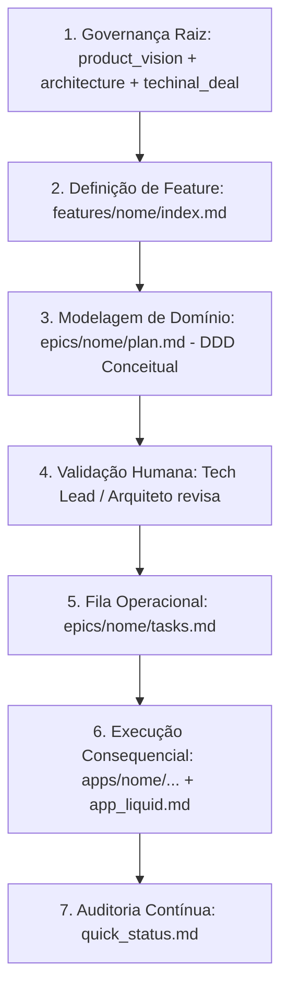

# Spec-Driven Development (Liquid Template) 💧

> **"A especificação é o software. O código-fonte é estritamente consequencial e descartável."**

Este repositório é o **template oficial** para inicialização de produtos sob a metodologia **Spec-Driven Development (Liquid v1)**. Ele foi concebido para ser utilizado como base (*blueprint*) no GitHub para qualquer novo produto desenvolvido com auxílio de Agentes Autônomos de IA (Hermes, Claude Code, Antigravity, Cursor, Copilot, etc.).

---

## 🧭 O Que é o Spec-Driven Development (Liquid)?

A Inteligência Artificial não resolveu a arquitetura de software; ela automatizou a escrita de sintaxe. No modelo **Liquid**, invertemos a hierarquia tradicional do desenvolvimento:

1. **A Documentação é o Contrato Executável:** O patrimônio duradouro do produto é a intenção de negócio, o domínio e as especificações imutáveis escritas em Markdown estruturado.
2. **O Código é Consequência:** O código físico gerado na pasta `apps/` é descartável e regenerável a qualquer momento a partir das specs.
3. **DDD Estritamente Conceitual no `plan.md`:** Eliminamos a modelagem pesada acoplada a bancos/ORMs no desenho de domínio. O DDD foca em *Bounded Contexts*, *Linguagem Ubíqua*, *Entidades/Invariantes* e *Eventos de Domínio*. Modelos físicos (tabelas, DDL, migrations, ORM) são planejados granularmente na fila de tarefas (`tasks.md`) e implementados na camada de adaptadores.

---

## 🏛️ Os 3 Pilares do Modelo Liquid

| Pilar | Descrição |
| :--- | :--- |
| **1. Isolamento Absoluto por Workspace** | Um workspace (contêiner) isolado por produto (`$HOME/product_design/meuproduto/`). Sem monorepos genéricos, blindando o raio de explosão e mitigando alucinações de contexto. |
| **2. Manifesto Universal (`app_liquid.md`)** | Cada software físico em `apps/` possui um manifesto agnóstico de metadados, orientando a IA sobre stack, propósito, entrypoint e contratos sem varredura de árvores profundas. |
| **3. Âncoras Programáticas (`index.md`)** | Navegação hierárquica baseada em arquivos `index.md`, otimizada para busca semântica, baixo consumo de tokens e indexação por LLMs. |

---

## 🌐 Referências Globais

O Liquid bebe das melhores práticas abertas da comunidade global de engenharia Spec-First:
- **[GitHub Spec-Kit](https://github.com/github/spec-kit):** Padronização de ciclo Constituição → Spec → Plano → Tarefas → Implementação.
- **[OpenSpec / SpecDD](https://specdd.ai):** Formatos padronizados de governança contra alucinações.
- **[The SDD Standard](https://github.com/mmanzini/Spec-driven-development):** Estruturas vivas de Product Briefs e Feature Specs.

---

## 📂 Anatomia do Repositório

```text
.
├── index.md                 # Guia mestre de navegação e governança do workspace
├── product_vision.md        # Visão macro, objetivos de negócio e problema central
├── roadmap.md               # Direcionamento estratégico e marcos globais do produto
├── architecture.md          # Arquitetura sistêmica (C4 Model abstrato e integrações)
├── techinal_deal.md         # Acordos técnicos, restrições e algemas da IA
├── team_playbook.md         # Regras de engajamento, ritos e fluxo de trabalho
├── AGENTS.md                # Instruções universais para agentes autônomos de IA
├── CLAUDE.md                # Bootstrap de inicialização nativo para o Claude Code
├── quick_status.md          # Painel de controle executivo global do produto
│
├── assets/                  # Wireframes, diagramas visuais e documentos de referência
│   └── README.md
│
├── apps/                    # Camada física: softwares consequenciais gerados pela IA
│   ├── README.md
│   └── _template_app/
│       └── app_liquid.md    # Manifesto universal da aplicação
│
├── features/                # Domínios e funcionalidades de negócio fatiados
│   ├── README.md
│   └── _template_feature/
│       ├── index.md         # Visão de negócio e escopo da feature
│       ├── feat_roadmap.md  # Marcos de entrega da feature
│       ├── quick_status.md  # Status local da feature
│       └── epics/
│           └── _template_epic/
│               ├── index.md         # Bounded Context, escopo do épico e critérios de aceite
│               ├── plan.md          # Enabler de Domínio (DDD conceitual: regras, eventos)
│               ├── tasks.md         # Fila de tarefas atômicas para o agente executar
│               ├── quick_status.md  # Rastro de auditoria local do épico
│               └── epic_roadmap.md  # Planejamento tático do épico
│
├── .agents/                 # Prompts de bootstrap e guias de ativação para Agentes (Hermes, etc.)
│   ├── hermes_bootstrap.md
│   └── prompts_guide.md
│
└── scripts/                 # Utilitários de scaffold para novas features e épicos
    └── scaffold.sh
```

---

## 🚀 Como Usar Este Template

### 1. Criando um Novo Produto no GitHub
Clique no botão **"Use this template"** no GitHub (ou clone o repositório em seu host Linux):

```bash
# Exemplo de criação no host Fedora:
mkdir -p $HOME/product_design/meuproduto
git clone <URL_DO_SEU_TEMPLATE> $HOME/product_design/meuproduto
cd $HOME/product_design/meuproduto
rm -rf .git
git init
```

### 2. Inicializando o Contexto Base
Preencha ou instrua o agente a preencher os arquivos de governança na raiz:
1. `product_vision.md`: Defina o problema e o valor de negócio.
2. `architecture.md`: Defina o modelo arquitetural de alto nível.
3. `techinal_deal.md`: Defina a stack permitida e restrições.
4. `roadmap.md`: Defina as fases macro do produto.

### 3. Subindo o Contêiner Isolado e Acionando o Agente (Hermes / Claude / Antigravity)
Inicie a sessão do agente apontando o volume **exclusivamente** para a pasta do produto (`$HOME/product_design/meuproduto/`).

Envie o comando de ativação (disponível em [`.agents/hermes_bootstrap.md`](file:///.agents/hermes_bootstrap.md)):

```text
"Este é um workspace Liquid v1 recém-inicializado. Leia todos os arquivos de governança na raiz (index.md, product_vision.md, architecture.md, techinal_deal.md) para assimilar o domínio deste produto. Confirme assim que estiver contextualizado para começarmos a delinear nossa primeira feature de negócio."
```

### 4. Criando Novas Features e Épicos
Utilize o script de scaffold ou duplique os templates:

```bash
# Tornar executável:
chmod +x scripts/scaffold.sh

# Criar uma nova feature:
./scripts/scaffold.sh feature auth-identidade

# Criar um novo épico dentro da feature:
./scripts/scaffold.sh epic auth-identidade login-social
```

---

## 🔄 O Ciclo de Desenvolvimento com Agentes



---

## 📄 Licença
Distribuído sob licença MIT. Sinta-se livre para usar, adaptar e evoluir em seus produtos.
