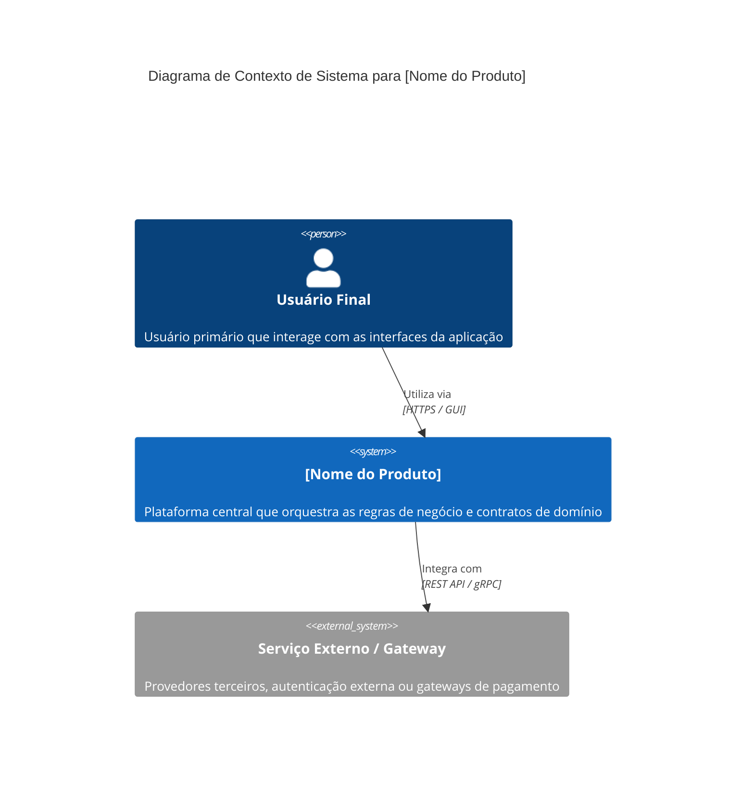
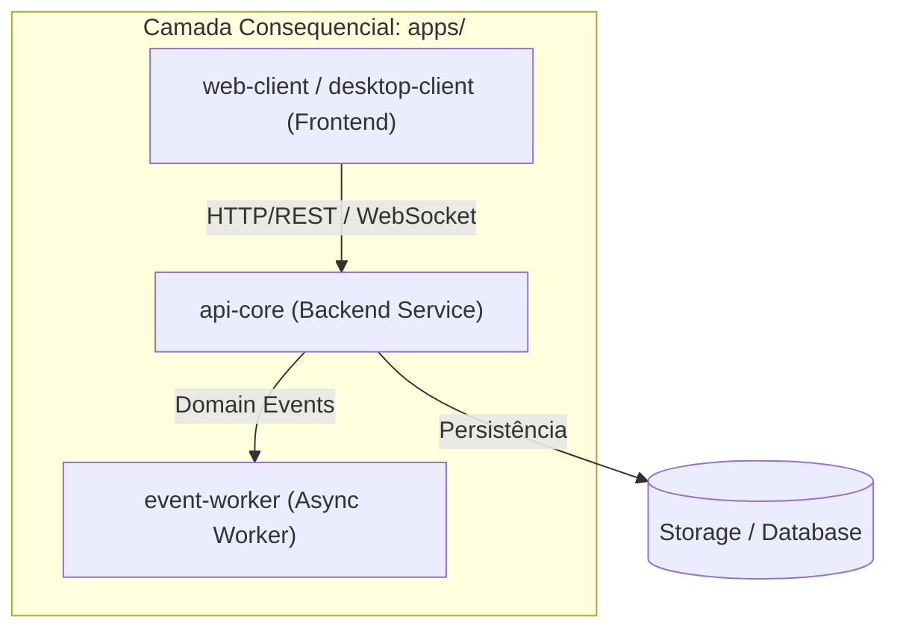

# Architecture Blueprint: [Nome do Produto]

> **Instruções:** Este arquivo documenta a arquitetura sistêmica do produto utilizando o modelo C4 conceitual, abstraindo detalhes mecânicos de implementação e focando em fronteiras, responsabilidades e fluxos de dados/eventos.

---

## 1. Visão Sistêmica Macro (C4 Level 1: Contexto)

O diagrama de contexto descreve os atores humanos e os sistemas externos com os quais o produto interage:

---

## 2. Visão de Contêineres / Aplicações (C4 Level 2: Containers)

Aplicações físicas que residem na camada consequencial `apps/`:

### Catálogo de Aplicações Mapeadas:
* **`apps/api-core`:** Serviço de backend responsável por expor endpoints e executar invariantes.
* **`apps/client`:** Interface do usuário conectada à API.
* **`apps/worker`:** Processador em segundo plano de tarefas assíncronas e eventos de domínio.

---

## 3. Bounded Contexts e Domínios Conceituais (DDD)

| Bounded Context | Responsabilidade Primária | Entidades Centrais | Eventos Disparados |
| :--- | :--- | :--- | :--- |
| **Identidade & Acesso** | Autenticação, perfis e permissões. | `Usuario`, `Sessao`, `Perfil` | `UsuarioCadastrado`, `LoginRealizado` |
| **[Domínio Central 1]** | [Regras de negócio centrais]. | `[EntidadeA]`, `[EntidadeB]` | `[EntidadeCriada]`, `[StatusAlterado]` |
| **[Domínio Central 2]** | [Processamento / Faturamento / Notificações]. | `[EntidadeC]` | `[ProcessamentoConcluido]` |

---

## 4. Topologia de Integração e Comunicação

1. **Comunicação Síncrona (Query / Command):**
   - Protocolo: [REST / GraphQL / gRPC]
   - Formato: JSON / Protobuf
   - Autenticação: Bearer Token / JWT
2. **Comunicação Assíncrona (Event-Driven):**
   - Padrão: Publish/Subscribe
   - Eventos publicados no formato CloudEvents / JSON canônico.

---

## 5. Requisitos Não-Funcionais & Restrições Sistêmicas

* **Segurança:** Criptografia em repouso e em trânsito (TLS 1.3). Sanitização rigorosa de inputs.
* **Disponibilidade & Resiliência:** Padrão Circuit Breaker e retries idempotentes para chamadas a terceiros.
* **Observabilidade:** Logs estruturados em formato JSON, métricas e rastreabilidade distribuída (Correlation ID em todas as requisições).

---

## 6. Registro de Decisões Arquiteturais (ADRs - Architecture Decision Records)

### ADR-001: [Título da Decisão Arquitetural, ex: Adoção de Arquitetura Hexagonal no api-core]
* **Status:** `[Proposto / Aprovado / Substituído]`
* **Contexto:** [Qual o cenário e problema técnico?]
* **Decisão:** [Qual a abordagem escolhida?]
* **Consequências Positivas:** [Benefícios obtidos]
* **Trade-offs / Riscos:** [Custos ou limitações aceitas]
