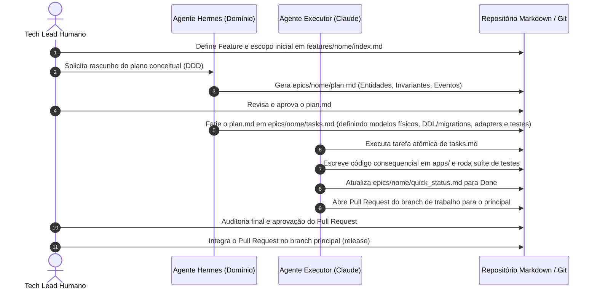

# Team Playbook & Workflow: [Nome do Produto]

> **Instruções:** Este arquivo estabelece as regras de engajamento, divisão de papéis entre humanos e agentes de IA, ritos de trabalho e os critérios de qualidade (DoR e DoD).

---

## 1. Matriz de Papéis e Responsabilidades (Human-Agent Team)

| Papel | Responsável | Atribuições Principais |
| :--- | :--- | :--- |
| **Arquiteto Supremo / Tech Lead** | Humano | Define a visão de produto (`product_vision.md`), aprova planos conceituais (`plan.md`), valida acordos técnicos e comanda o roadmap. |
| **Domain Enabler (Hermes / Architect Agent)** | Agente de IA | Analisa a intenção de negócio, modela o DDD conceitual em `plan.md`, mapeia eventos e valida consistência sistêmica. |
| **Task Executor (Claude Code / Antigravity)** | Agente de IA | Executa atomicamente a lista em `tasks.md`, gera código consequencial em `apps/`, roda testes e atualiza `quick_status.md`. |
| **Reviewer & QA** | Humano + Scripts | Executa auditoria contínua, valida os critérios de aceite e aprova o Pull Request. |

---

## 2. Ritos de Desenvolvimento Sequencial

---

## 3. Definition of Ready (DoR) — Pronto para Iniciar

Um Épico só pode ter sua execução de código iniciada se satisfizer o seguinte checklist:
- [ ] `index.md` do épico detalha o escopo de negócio e critérios de aceitação.
- [ ] `plan.md` está modelado conceitualmente com Entidades, Invariantes e Eventos de Domínio sem acoplamento a ORM.
- [ ] `plan.md` foi explicitamente revisado e aprovado pelo Tech Lead humano.
- [ ] `tasks.md` contém tarefas atômicas e ordenadas com critérios claros de verificação.
- [ ] Manifesto [`app_liquid.md`](apps/) da aplicação alvo está atualizado.

---

## 4. Definition of Done (DoD) — Pronto para Entrega

Um Épico só é considerado concluído (`Done`) quando:
- [ ] 100% das tarefas listadas em `tasks.md` estiverem marcadas como completadas `[x]`.
- [ ] A suíte de verificação automatizada do épico passar integralmente, sem erros. O **objeto** dessa verificação é definido pelo `plan.md` do épico, conforme o §4.1 abaixo.
- [ ] Nenhum código violar os acordos técnicos de [`technical_agreement.md`](technical_agreement.md).
- [ ] `quick_status.md` local do épico e da feature foram atualizados com o rastro de auditoria.
- [ ] Commit Git estruturado no padrão Conventional Commits.

### 4.1 Épicos sem domínio conceitual: o que a suíte verifica

Nem todo produto tem domínio rico. Existem produtos e épicos inteiros que não têm transação, não mutam estado, não têm ciclo de vida de entidade e, portanto, **não têm regra de negócio invariante** — sites e portais de conteúdo, geradores, ferramentas de apresentação e camadas puramente de habilitação são os casos típicos.

Aplicar a esses casos a exigência literal de "testes unitários de invariantes de domínio" produz um de dois resultados, ambos ruins: ou o épico nunca pode ser marcado `Done`, ou se fabricam entidades e invariantes falsas apenas para satisfazer o molde — exatamente a invenção não ancorada em intenção de negócio que este método existe para impedir.

Fica estabelecido, como regra geral do método:

1. **Um `plan.md` PODE declarar explicitamente a ausência de domínio conceitual**, acompanhada da justificativa que sustenta a declaração. Isso é um **resultado legítimo da modelagem, não uma falha dela**. Um `plan.md` que declara ausência de domínio com justificativa correta satisfaz o item de modelagem conceitual do DoR (§3).
2. **Quando o `plan.md` declara essa ausência, o critério de conclusão aceita invariantes de publicação — ou, de forma geral, invariantes do artefato entregue — verificadas por checker automatizado**, no lugar dos testes de invariante de domínio. **A suíte verde continua obrigatória e o rigor é o mesmo; o que muda é o objeto verificado.**
3. **A declaração de ausência não dispensa verificação.** Um épico sem domínio e sem checker de invariantes verificáveis não é `Done` — é um épico sem critério de conclusão, e deve ser recusado na auditoria.

**Catálogo de referência de invariantes de artefato.** Produtos de conteúdo publicado costumam sustentar as seguintes invariantes, todas verificáveis por checker automatizado. O catálogo é ponto de partida, não camisa de força: cada épico declara em seu `plan.md` quais adota e por quê.

| Id | Invariante | Enunciado verificável |
| :--- | :--- | :--- |
| **INV-01** | Âncora única | Todo artefato publicado tem exatamente um endereço canônico; nenhum conteúdo é alcançável por dois caminhos sem canônico declarado. |
| **INV-02** | Integridade referencial | Nenhum artefato publicado referencia arquivo, documento ou recurso que não exista de fato na origem. |
| **INV-03** | Vocabulário único | Todo termo do glossário aparece com a definição do glossário; sinônimos proibidos não aparecem em conteúdo publicado. |
| **INV-04** | Rastreabilidade | Toda afirmação publicada é atribuível a um documento de spec identificável. |
| **INV-05** | Autoconsistência | O artefato publicado não afirma nada que o repositório de origem não pratique. |

O enquadramento conceitual e a justificativa dessas invariantes seguem a análise de modelagem que fundamentou esta emenda, registrada no plano de features do produto.
