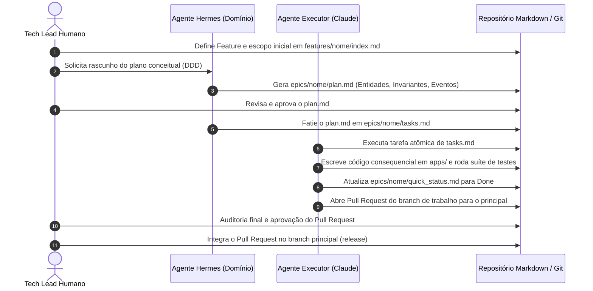

# Team Playbook & Workflow: [Nome do Produto]

> **Instruções:** Este arquivo estabelece as regras de engajamento, divisão de papéis entre humanos e agentes de IA, ritos de trabalho e os critérios de qualidade (DoR e DoD).

---

## 1. Matriz de Papéis e Responsabilidades (Human-Agent Team)

| Papel | Responsável | Atribuições Principais |
| :--- | :--- | :--- |
| **Arquiteto Supremo / Tech Lead** | Humano | Define a visão de produto (`product_vision.md`), aprova planos conceituais (`plan.md`), valida acordos técnicos e comanda o roadmap. |
| **Domain Enabler (Hermes / Architect Agent)** | Agente de IA | Analisa a intenção de negócio, modela o DDD conceitual em `plan.md`, mapeia eventos e valida consistência sistêmica. |
| **Task Executor (Claude Code / Antigravity)** | Agente de IA | Executa atomicamente a lista em `tasks.md`, gera código consequencial em `apps/`, roda testes e atualiza `quick_status.md`. |
| **Reviewer & QA** | Humano + Scripts | Executa auditoria contínua, valida os critérios de aceite e aprova o Pull Request. |

---

## 2. Ritos de Desenvolvimento Sequencial

---

## 3. Definition of Ready (DoR) — Pronto para Iniciar

Um Épico só pode ter sua execução de código iniciada se satisfizer o seguinte checklist:
- [ ] `index.md` do épico detalha o escopo de negócio e critérios de aceitação.
- [ ] `plan.md` está modelado conceitualmente com Entidades, Invariantes e Eventos de Domínio sem acoplamento a ORM.
- [ ] `plan.md` foi explicitamente revisado e aprovado pelo Tech Lead humano.
- [ ] `tasks.md` contém tarefas atômicas e ordenadas com critérios claros de verificação.
- [ ] Manifesto [`app_liquid.md`](apps/) da aplicação alvo está atualizado.

---

## 4. Definition of Done (DoD) — Pronto para Entrega

Um Épico só é considerado concluído (`Done`) quando:
- [ ] 100% das tarefas listadas em `tasks.md` estiverem marcadas como completadas `[x]`.
- [ ] Todos os testes unitários e de integração passarem sem erros.
- [ ] Nenhum código violar os acordos técnicos de [`techinal_deal.md`](techinal_deal.md).
- [ ] `quick_status.md` local do épico e da feature foram atualizados com o rastro de auditoria.
- [ ] Commit Git estruturado no padrão Conventional Commits, em branch próprio conforme [`techinal_deal.md`](techinal_deal.md).
- [ ] Pull Request aberto para o branch principal, com título no padrão Conventional Commits.
- [ ] Pull Request revisado e aprovado pelo Reviewer & QA antes da integração.
